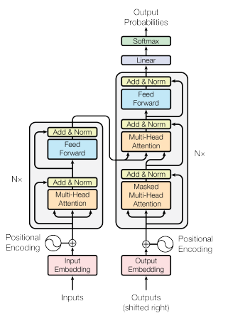
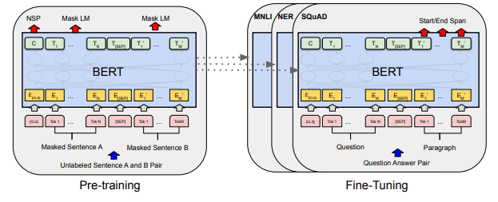
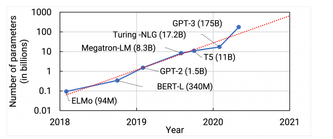

# BERT-Question-Answering
Answering questions on text documents using Bidirectional Encoder Representations from Transformers (BERT) [1].

## Overview

BERT is among the famous transformer-based deep learning architectures that have made headlines in recent years in NLP. The variations on GPT and BART are other famous architectures of note. 

A high-level attribute that distinguishes BERT from the GPT (Generative Pre-trained Transformer) class of models is that BERT is bidirectional while GPT is 

These transformer architectures for natural language understanding build from the original architecture [2].

 

BERT can be understood as borrowing heavily from the encoder portion of that original tranformer architecture, while GPT can be understood as tracing its origins to the decorder portion of the original transformer architecture. 

 

Key breakthroughs that have come with the transformer revolution in deep learning include self-supervision, which allows the training phase to leverage large unlabeled datasets for pre-training (see [3] for deeper discussions), 
and self-attention, which facilitates the encoding of long-range dependencies. The wide-spread dissemination of these innovations have driven a new era of scaling in cutting edge deep learning architectures.

  

## References

[1] Devlin, Jacob, Ming-Wei Chang, Kenton Lee, and Kristina Toutanova. "Bert: Pre-training of deep bidirectional transformers for language understanding." arXiv preprint arXiv:1810.04805 (2018).

[2] Vaswani, Ashish, Noam Shazeer, Niki Parmar, Jakob Uszkoreit, Llion Jones, Aidan N. Gomez, Łukasz Kaiser, and Illia Polosukhin. "Attention is all you need." Advances in neural information processing systems 30 (2017).

[3] Bommasani, Rishi, Drew A. Hudson, Ehsan Adeli, Russ Altman, Simran Arora, Sydney von Arx, Michael S. Bernstein et al. "On the opportunities and risks of foundation models." arXiv preprint arXiv:2108.07258 (2021).

[4] Raschka, Sebastian, Yuxi Liu, and Vahid Mirjalili. "Machine Learning with PyTorch and Scikit-Learn." (2022). 

[5] https://www.youtube.com/watch?v=iFhYwEi03Ew for context)

[6] https://developer.nvidia.com/blog/scaling-language-model-training-to-a-trillion-parameters-using-megatron/

